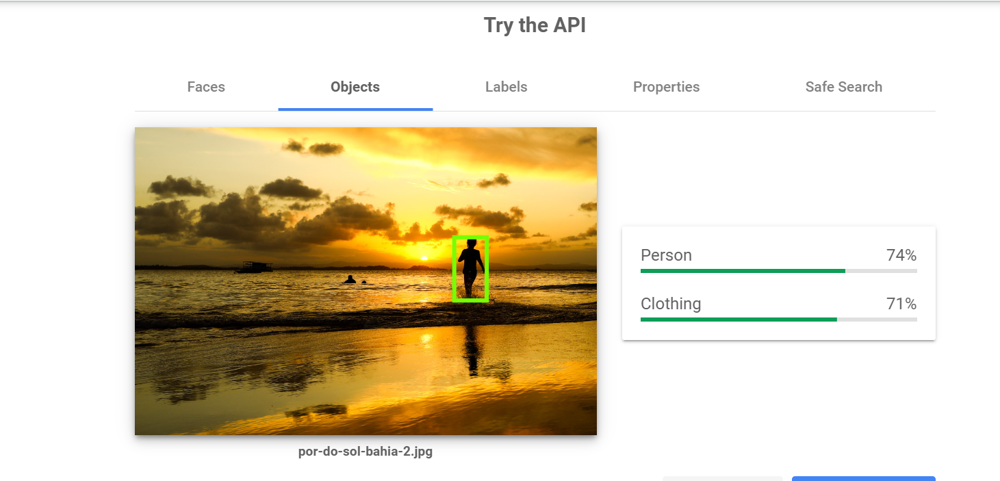

# Relatório Técnico: Tarefas de Processamento de Imagem

Este relatório tem como intuito fornecer uma visão geral das capacidades e aplicações de duas tarefas cruciais de processamento de imagem — Classificação de Imagens e Detecção de Objetos —, destacando seu impacto e utilidade em diversos setores da indústria.

## 1. Classificação de Imagens

### Descrição da tarefa

A classificação de imagens é um processo onde um modelo de aprendizado de máquina atribui uma etiqueta ou classe a uma imagem inteira. Este processo é essencial em muitos sistemas de visão computacional onde o contexto global da imagem é mais importante do que os detalhes específicos dos objetos presentes​.

### Aplicações Possíveis

Além do uso básico em categorizar imagens em galerias fotográficas, a classificação de imagens tem aplicações vastas como diagnóstico médico, reconhecimento facial, inspeção de qualidade em manufatura e gestão de conteúdo digital.

### Produtos Comerciais Relacionados

Alguns produtos que utilizam classificação de imagens incluem o Google Cloud Vision API e sistemas de catalogação automática de imagens em plataformas como Adobe Stock e Getty Images.

### Segmentos de Mercado

Os principais segmentos de mercado incluem saúde, segurança, varejo, agricultura e mídia digital.

## 2. Detecção de Objetos

### Descrição da Tarefa

A detecção de objetos envolve a identificação e localização de múltiplos objetos dentro de uma imagem. Esta tarefa difere da classificação por necessitar não só reconhecer o objeto, mas também determinar onde ele está localizado na imagem e muitas vezes delimitar seu contorno​.

### Aplicações Possíveis

A detecção de objetos é amplamente usada em sistemas de vigilância, navegação autônoma de veículos, análise de vídeo em tempo real para segurança pública, e em aplicações industriais para detectar defeitos em produtos durante a fabricação.

### Produtos Comerciais Relacionados

Produtos notáveis incluem sistemas de câmeras de segurança inteligentes que podem identificar e seguir indivíduos ou veículos suspeitos, e soluções de automação industrial que utilizam detecção de objetos para otimizar processos de montagem ou embalagem.

### Segmentos de Mercado

Este tipo de tecnologia é crucial para a segurança pública, automotiva, transporte, fabricação e entretenimento.

## Teste de Produto

Utilizando a API do Google Cloud Vision, uma imagem de teste foi submetida e o modelo foi capaz de identificar corretamente o objeto da imagem com alta precisão.

